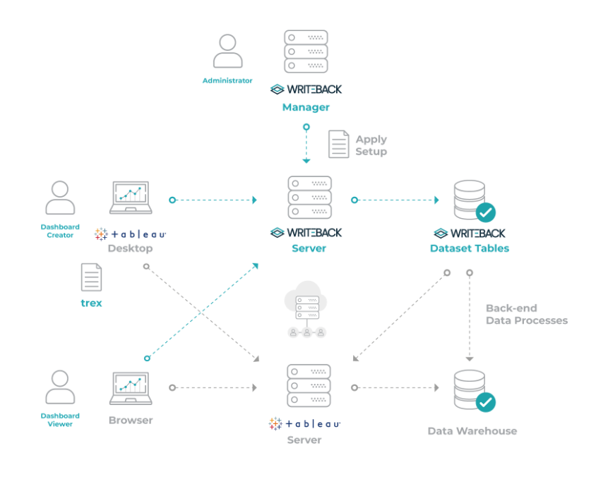

# tableau-writeback
This explains a simple approach to implement a writeback functionality in Tableau 2020.1.
There have been numerous use cases that involes requirements where the users would like to interact with the Active Dashboards and perform drill downs.
Also, there are requirements to add comments and publish them to the user community.
These comments or commentary needs to be persisted along with the data elements displayed on the Dashboard.

Tableau by its Design is a read-only tool and provides a rich user experience when it comes to Interactive Dashboards, Data Discovery and Visualisations need.

When I was asked for a functionality that required user to be able to access the Dashboard, select a row on a specific workbook and add commentary, I explored a number of options including the extensions that have been written as part of Tableau Extension Community.

## Evaluations for different options
* WRITEBACK - This is one of the extensions that has been built by Writeback to serve this purpose for the Tableau Community.This tool is quite neat and supports a number of features including commenting, forecasting, replacing values etc.
 Writeback can be deployed in an Enterprise environment using below topology;
 
